# Guide to setting up ESP-IDF environment & simple usage

To build and flash provided ESP code, follow the installation procedure then skip to step 4 of the build procedure.

### NOTES:

***Windows 10 procedure.***  
Up to date VScode is a prerequisite.  
This require a sizeable chunk of disk space, but you can delete the installed SDK later if needed.  
***this is what worked for me.***

### ESP IDF basic installation

1: In VScode, install the extension "Espressif IDF".  

 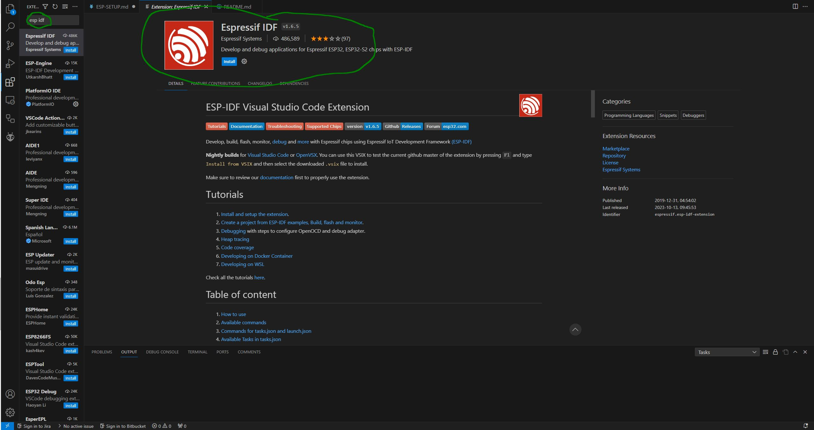 
  
2: Open the extension on the left side (you may need to dig for it), the first opening will run the IDF Setup (this might take a bit).  

3: Click Express

 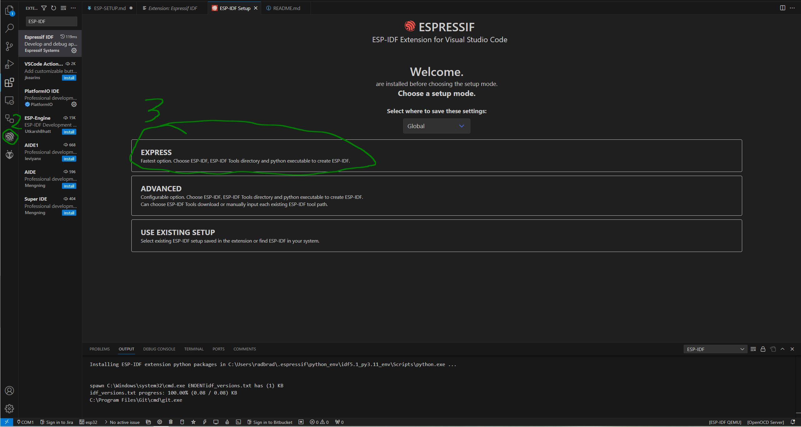 
 
4: Change the ESP-IDF version to the latest release (v5.1.2). 

I kept the default directories, if you changed them write them down for the environment variable setup.  

5: Click install (this will take a awhile to setup the sdk, maybe 10+ minutes).  

 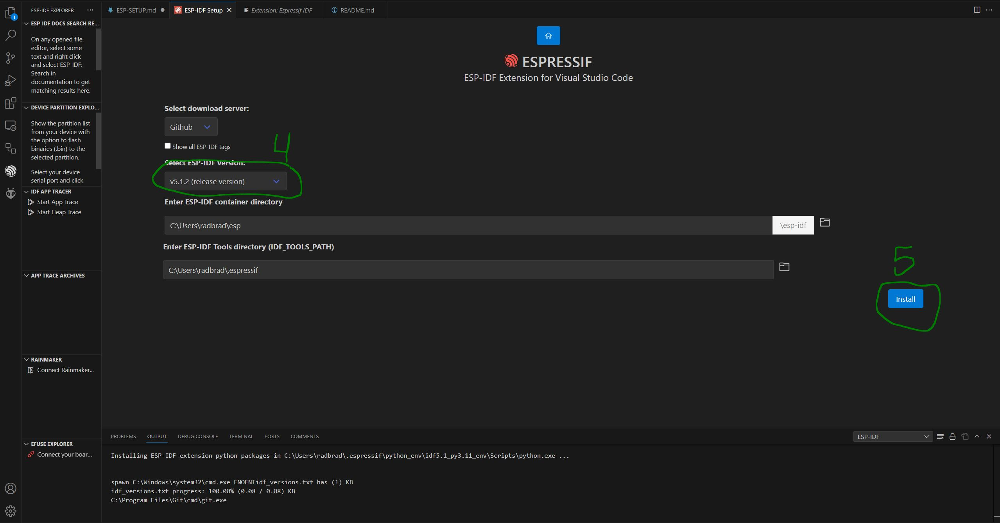 
 

### Enviornment variable setup 

Use these instead of using relative paths in each project.  
6: Search up "advanced system settings" in  your start menu and open "view advanced system settings"  
Advanced tab->Environment Variables...  

 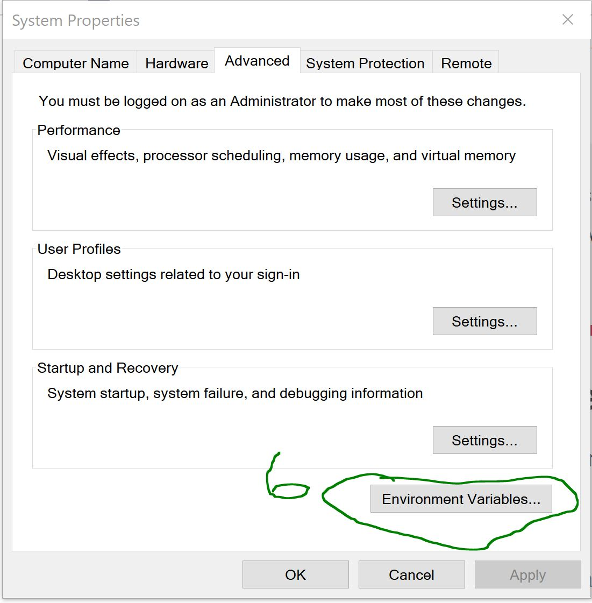 
 
7: Add a variable by clicking "New" in the system variables tab  

Variable Name: IDF_PATH  
Variable value: C:\Users\<User>\esp\esp-idf  
(replace <User> with your local username directory)  

  
 

 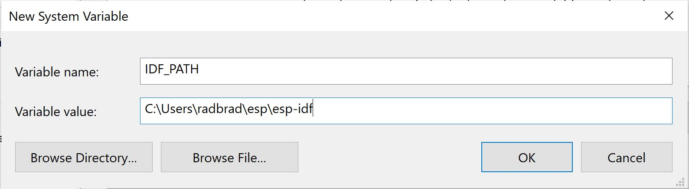 
 

8: Add another variable in the same way:  
Variable Name: IDF_TOOLS_PATH  
Variable value: C:\Users\<User>\.espressif  

### Programming driver installation
9: Go to
https://www.silabs.com/developers/usb-to-uart-bridge-vcp-drivers?tab=downloads
download the CP210x Universal Windows Driver

 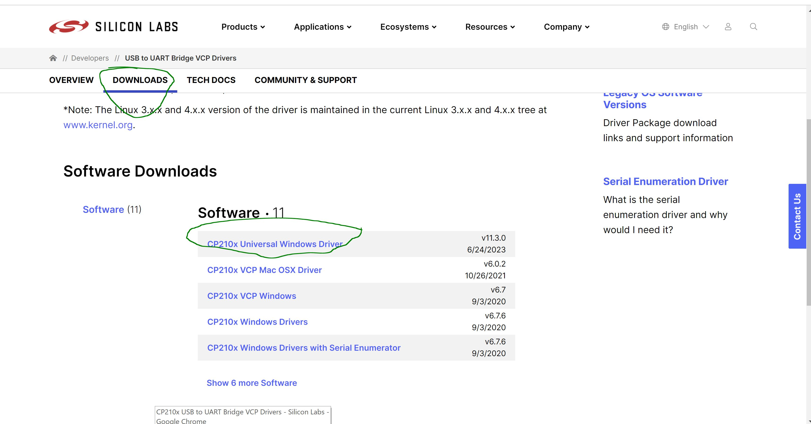 
 

10: Extract the zip into a known directory (not downloads)

 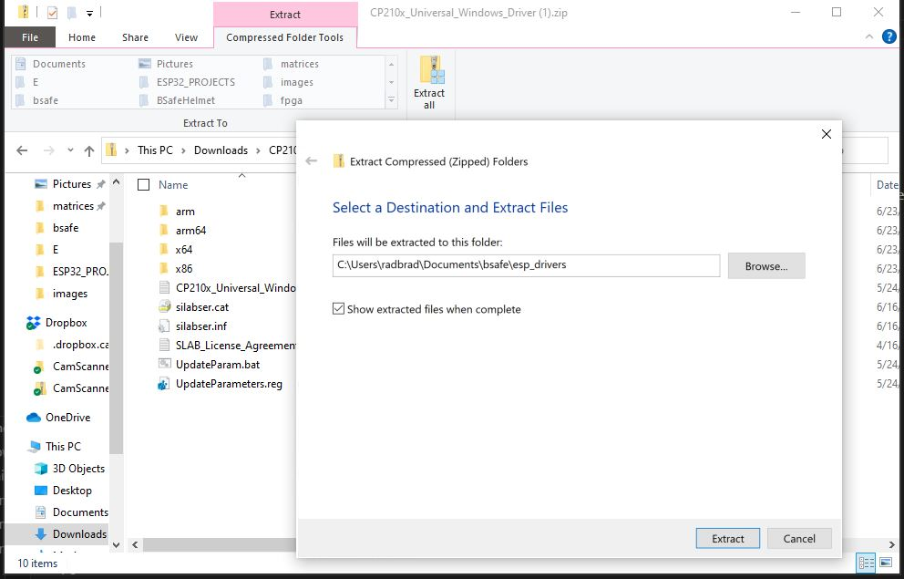 

11: Right click silibser.inf and click install, then follow prompts

 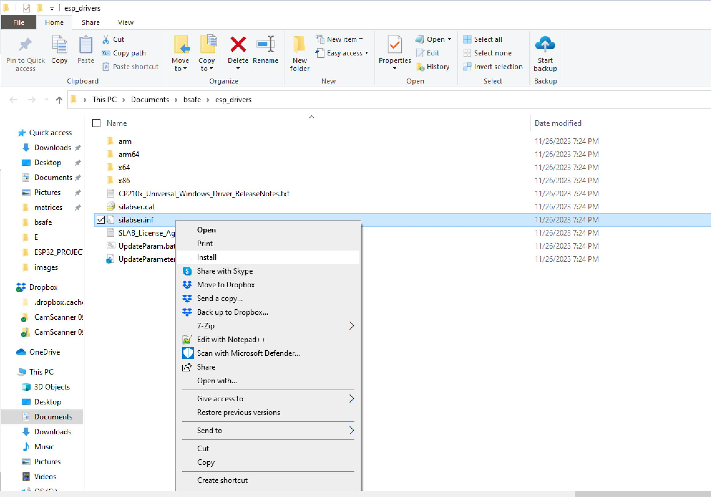 

### Basic install finished!! :)

## Uses and information:

### Command pallet notes

Interact with the VSCode Espressif IDF extension using predefined commands in the command pallet  
ctrl+shift+p to open the command pallet or  
click search in the top middle and type ">"  
Espressif commands begin with "ESP-IDF:"  

### Intro workflow with commands
1: *ctrl+shift+p*
To open command pallet, then type:  **ESP IDF: Show Examples Project**  
Press enter to indicate the working directory
Opens a menu of example projects, there are many to choose from.  
select "blink" from the get started and use the big blue button to create the project directory.

 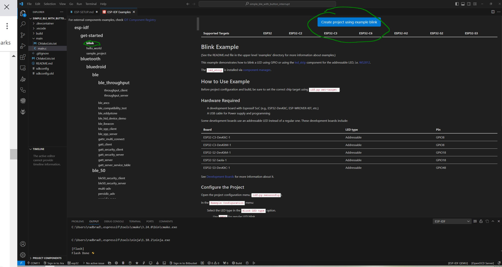 

2: Keep using the command pallet: **ESP IDF: Set Espressif device target**  
Select ESP32, hit enter, then select custom board and hit enter again.
*We are using a DevkitV1, an unofficial board and therefore we select custom*.

3: In .vscode/settings.json change "default" to "Tag Parser" after "C_Cpp.intelliSenseEngine".
*This tells VSCode that we are using ESP IDF coding guidelines before compilation*

 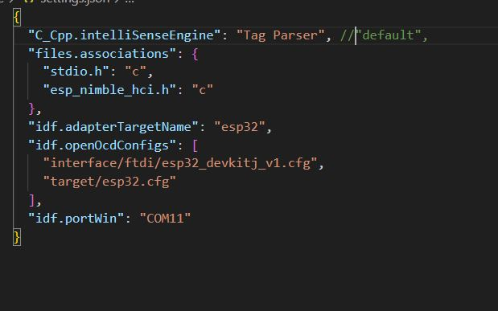 

4: Run menuconfig: **ESP IDF: SDK Configuration editor(menuconfig)**  
This opens a UI config editor, we don't need this right now but it is good to know about.
*To build the BLE code running NimBLE like in the simple_ble_with_button_interrupt project, make sure that bluetooth is enabled and NimBLE is selected while in menuconfig*

 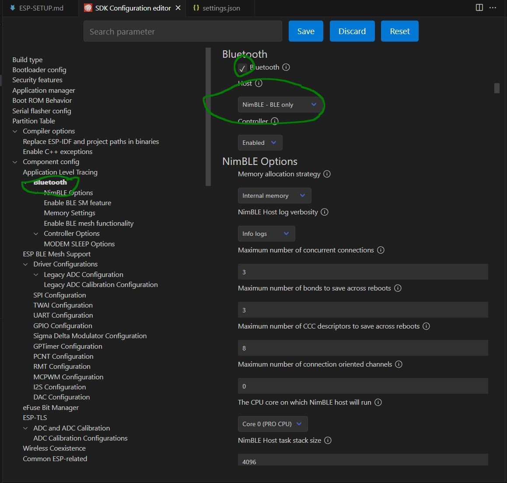 

5: Build the code: **ESP IDF: Build Your Project**
This runs CMake and builds the code, the first build is going to take some time.

6: Make sure you plugged in your ESP32 DevkitV1 board and then open device manager from windows start menu.  
Under Ports(Com & LPT) find your ESP32 under CP210x and write down the COM number.

7: Select the port using: **ESP IDF: Select port to use**, and pick the one you just found in device manager.

8: After you finished building the code and selecting the correct port, you can flash your ESP32 with:  **ESP IDF: Flash your (UART) project**

9: With the ESP32 connected and flashed, you can open the serial monitoring terminal with: **ESP IDF: Monitor your device**

